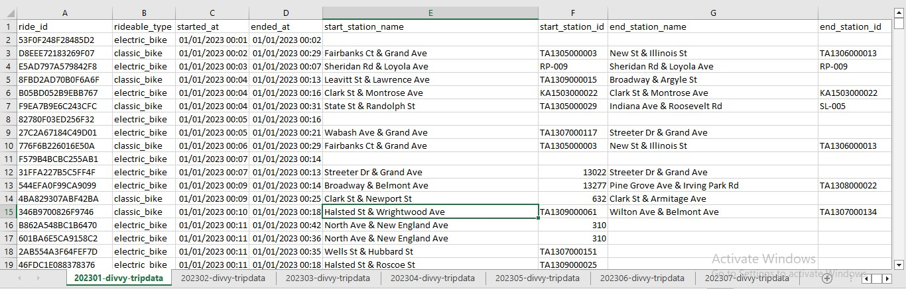
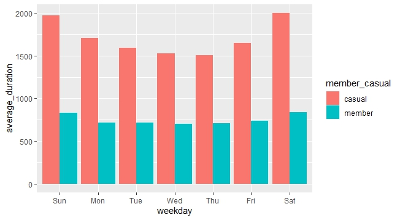
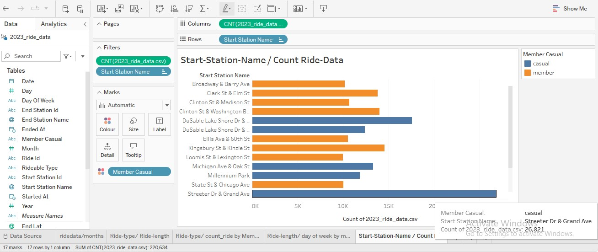
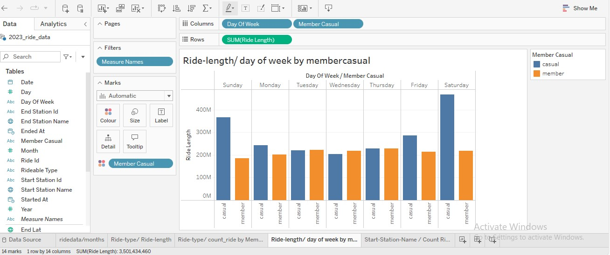
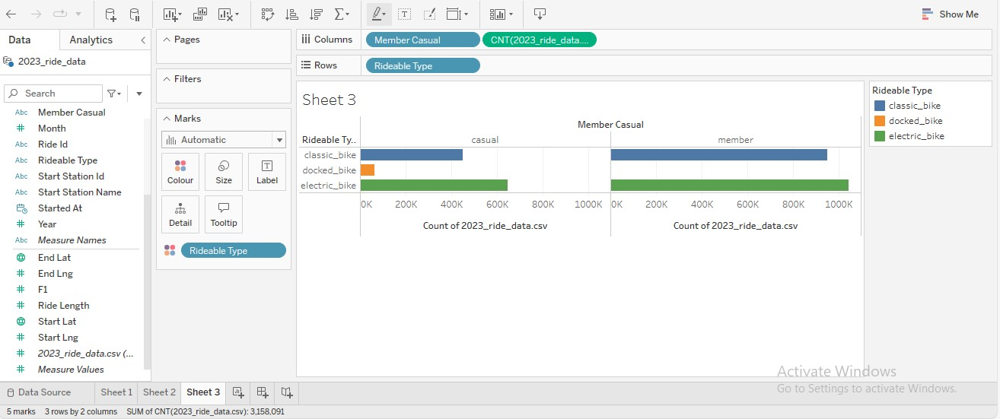
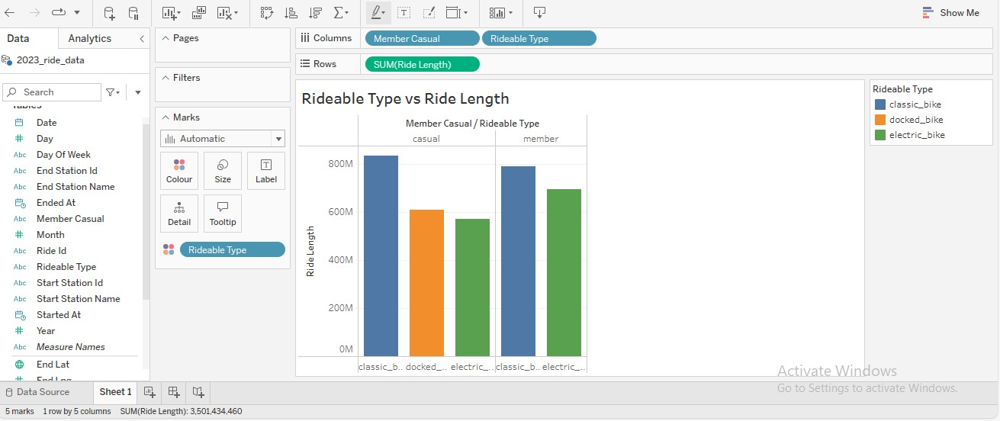
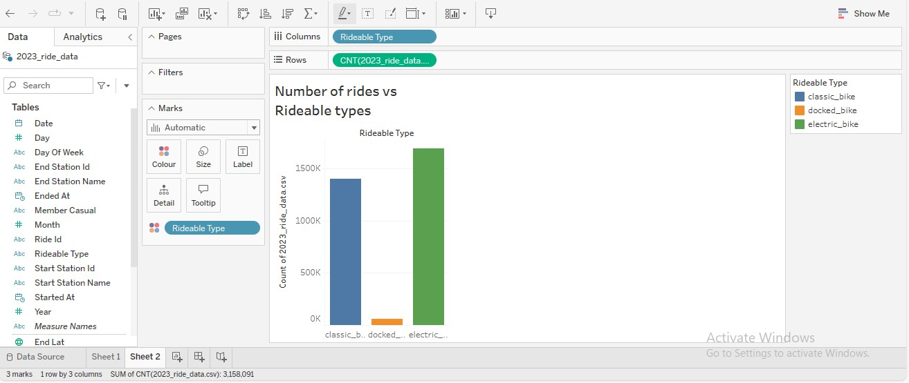

# Cyclistic Bike-Share Analysis

## Introduction

Welcome to the Cyclistic bike-share analysis case study! In this case study, you will perform many real-world tasks of a junior data analyst. You will work for a fictional company, Cyclistic, and meet different characters and team members. In order to answer the key business questions, you will follow the steps of the data analysis process: **ask, prepare, process, analyze, share, and act**.

## Case Study Overview

## Ask

-   **Goal**

Design Marketing strategies aimed at converting casual riders into annual members.

-   **Business Task**

Identify how annual members and casual riders use Cyclistic bikes differently.

-   **Key Stakeholders**

    Lily Moreno: The director of marketing and your manager.

    Cyclistic marketing analytics team: a team of data analysts responsible for collecting, analyzing, and reporting data.

    Cyclistic executive team.

-   **Data Sources**

Data collected from the first quarter of 2020 (Q1). The data has been made available by Motivate International Inc. under this [license](https://divvybikes.com/data-license-agreement).

## Prepare

-   Sorted the data to according to the started day and time.
-   Adjusted the column width to fit the content.

## Process

-   Created a column called "ride_length."
-   Created a column called "day_of_week."
-   Calculated the day of the week that each ride started using the "WEEKDAY" command (for example, =WEEKDAY(C2,1)) in each file. Format as General or as a number with no decimals, noting that 1 = Sunday and 7 = Saturday.

## Analyze

### Aggregation using R

Data aggregation is done in the R script. Here are the steps taken:

-   Collect data, create dataframes for the 7 months of data.
-   Inspected the data for aggregation.
-   Combine data into one table/dataframe.
-   Add columns that list the date, month, day, and year.
-   Convert "started_at" and "ended_at" to date-time objects to get the ride_length in seconds.
-   Aggregated the data to find key relationships and patterns.

### Key Insights

-   Members have more rides compared to casual members.

-   However, casual members spend more time on the bike compared to members.

-   Exported the summary file for further analysis

## Share

I took my polished data to tableau public and got the following insights.

##### COUNT OF RIDE DATA AGAINST MONTHS

-   The number of rides increases drastically from March 2023 which is after winter, for both casual and members. Thus, bike riding is seasonal.

-   We can also see that members have more rides compared to casual members.

    ##### START-STATION NAME/COUNT RIDE-DATA

    

-   I also wanted to figure out the location that had most rides. According to the visualization, **Streeter Dr & Grand Ave** had the most rides.

-   Casual riders often use the **Streeter Dr & Grand Ave** as their start station.

##### RIDE-LENGTH / DAY OF WEEK

-   Casual riders spend more time on the bike compares to members.

-   Casual riders ride the most during the weekends and least on wednesday.

-   Member riders take the almost the same time riding daily.

##### RIDE TYPE VS COUNT OF RIDES

-   From this we can see that, member riders do not use the docked bike.

-   Member riders use the electric bike more than casual riders.

-   Member riders also use the classic bikes more then the casual riders.

##### RIDEABLE TYPE VS RIDE LENGTH

-   They both spend more time on the classic bikes but casual riders spend the most time.

##### NUMBER OF RIDES VS RIDEABLE TYPES

-   Electric bikes have been rode on the most.

-   The docked bikes have the least number of rides.
